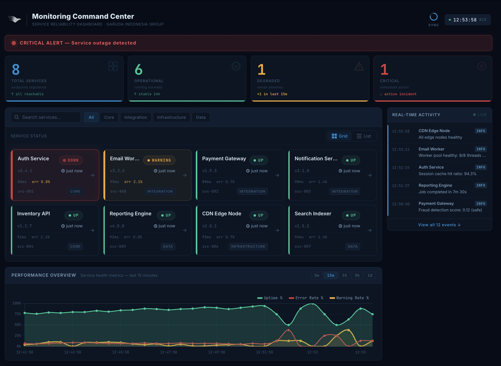

# Monitoring Command Center

Centralized real-time service monitoring dashboard built for **GMF AeroAsia** as part of the Service Reliability Initiative. Designed for high-glanceability — an engineer should know at a glance whether a service is healthy or critical, from across the room.

---

## Demo Video

▶️ [Watch demo on Google Drive](https://drive.google.com/file/d/1FJw8yvMhFMBAZSj01nVTetMHY0wkcHDS/view?usp=sharing)

> Covers: login flow, live polling, service detail, error simulation (500/404 via curl), auto-recovery.

---

## Screenshots

### Dashboard


### Login Page


---

## Setup Guide

**Prerequisites:** Node.js 18+ and npm installed.

```bash
# 1. Clone and install dependencies
npm install

# 2. Start mock server (port 3000) + Angular dev server (port 4200) simultaneously
npm start
```

Open `http://localhost:4200` — you will be redirected to the login page.

**Demo credentials:**
```
Username: admin
Password: admin123
```

> To run servers separately: `npm run mock` (port 3000 only) and `npm run serve` (port 4200 only).

### Production Build

```bash
npm run build
```

Output is written to `dist/monitoring-command-center/`. The production build enables:
- Full minification and tree-shaking
- Content hash on all output files (`outputHashing: all`)
- Source maps disabled
- Environment file replacement (`environment.ts` → `environment.prod.ts`)

### Running Tests

```bash
npm test
```

Uses **Vitest** (via `@angular/build:unit-test`). 11 tests across 2 test suites.

---

## Available Scripts

| Script | Description |
|---|---|
| `npm start` | Mock server + Angular dev server (concurrent) |
| `npm run mock` | Mock server only (port 3000) |
| `npm run serve` | Angular dev server only (port 4200) |
| `npm run build` | Production build to `dist/` |
| `npm test` | Unit test suite (Vitest) |

---

## Tech Stack

| Concern | Choice | Reason |
|---|---|---|
| Framework | Angular 21 (NgModules) | Explicit module boundaries, no standalone shortcut |
| Mock Server | json-server 0.17 + Express middleware | Zero config, easy to extend |
| State | RxJS `BehaviorSubject` | Built-in, no extra library needed |
| Styling | SCSS + CSS custom properties | Dark theme tokens, no UI library dependency |
| Routing | Angular Router with lazy loading + `AuthGuard` | Small initial bundle, protected routes |
| Charts | ng2-charts v9 + Chart.js | Performant canvas-based time-series chart |
| Testing | Vitest via `@angular/build:unit-test` | Angular 21 default, fast |

---

## Architecture

### Project Structure

```
monitoring-command-center/
├── mock-server/
│   ├── db.json              — seed data: 8 services, 40 log entries
│   ├── middleware.js         — random status mutation, error simulation
│   └── server.js             — json-server Express wrapper
├── src/
│   ├── environments/
│   │   ├── environment.ts        — development (apiUrl: '')
│   │   └── environment.prod.ts   — production (apiUrl: '')
│   └── app/
│       ├── core/
│       │   ├── guards/
│       │   │   └── auth.guard.ts         — CanActivate: redirect to /login if unauthenticated
│       │   ├── interceptors/
│       │   │   ├── auth.interceptor.ts   — attaches Bearer token to every HTTP request
│       │   │   └── error.interceptor.ts  — retry logic (500 ×3, 3s delay), error mapping
│       │   ├── models/
│       │   │   └── service-item.model.ts — ServiceItem, LogEntry, ActivityItem interfaces
│       │   └── services/
│       │       ├── auth.service.ts        — login/logout, sessionStorage token
│       │       ├── monitoring.service.ts  — polling BehaviorSubjects, log fetching
│       │       └── sidebar.service.ts     — collapsed$ toggle stream
│       ├── features/
│       │   ├── auth/                      — lazy module: LoginComponent
│       │   ├── dashboard/                 — lazy module: service grid, KPI cards, chart
│       │   └── detail/                    — lazy module: log stream terminal view
│       └── shared/
│           ├── status-badge/  — UP/DOWN/WARNING badge with pulse animation on DOWN
│           ├── error-banner/  — error state display with aria-live
│           └── skeleton/      — shimmer cards for initial load state
├── docs/
│   └── screenshots/          — feature evidence images
└── proxy.conf.json           — proxies /api/* to localhost:3000
```

### Data Flow

```
MockServer (port 3000)
        │
        │  HTTP /api/services  (every 15s)
        ▼
MonitoringService
  ├── services$        BehaviorSubject<ServiceItem[]>
  ├── error$           BehaviorSubject<string | null>
  ├── isInitialLoading$ BehaviorSubject<boolean>
  ├── isRefreshing$    BehaviorSubject<boolean>
  └── lastSyncAt$      BehaviorSubject<Date | null>
        │
        │  async pipe (no manual subscribe)
        ▼
DashboardComponent          DetailComponent
  ├── filteredServices$        ├── service$  (find by id)
  ├── summary$                 └── logs$     (re-fetches on lastSyncAt$)
  ├── activityFeed$
  └── chartData (push on each summary$ tick)
```

---

## Architecture Decisions — The Why

### `switchMap` over `mergeMap` for polling

```typescript
timer(0, 15_000).pipe(
  switchMap(() => this.fetchServices()), // cancels the previous in-flight request
)
```

`switchMap` cancels the previous HTTP request before issuing a new one. With `mergeMap`, if a request takes longer than 15 seconds (e.g., during a slow 500 retry), multiple requests would overlap — causing race conditions where stale data overwrites fresh data.

### `BehaviorSubject` over `Subject`

```typescript
readonly services$ = new BehaviorSubject<ServiceItem[]>([]);
```

A `Subject` only delivers values to subscribers active *at the time of emission*. A `BehaviorSubject` replays the last emitted value to any new subscriber. Components that mount after the first poll (e.g., after a route navigation) receive data instantly instead of waiting up to 15 seconds for the next tick.

### Two loading states — `isInitialLoading$` and `isRefreshing$`

```typescript
readonly isInitialLoading$ = new BehaviorSubject<boolean>(true);
readonly isRefreshing$     = new BehaviorSubject<boolean>(false);
```

A single `loading$` flag would blank out the dashboard every 15 seconds, defeating high-glanceability. Separating the two states means:

- **Initial load** → skeleton screen (no data yet)
- **Background refresh** → cards remain visible, a small header spinner appears

This matches the behavior of Grafana and Datadog.

### `lastSyncAt$` as a sync signal

```typescript
// Both dashboard feed and detail logs piggyback on the same poll cycle
this.monitoring.lastSyncAt$.pipe(
  filter(Boolean),
  switchMap(() => this.monitoring.getServiceLogs(id, 10))
)
```

Rather than introducing a second independent `timer`, the activity feed and detail log stream subscribe to `lastSyncAt$`. This guarantees logs and service statuses are always in sync — they refresh together on the same tick, never 7.5 seconds apart.

### Lazy loading for all feature modules

```typescript
// app-routing-module.ts
{ path: 'login',     loadChildren: () => import('./features/auth/auth.module') },
{ path: '',          canActivate: [AuthGuard], loadChildren: () => import('./features/dashboard/dashboard.module') },
{ path: 'detail/:id', canActivate: [AuthGuard], loadChildren: () => import('./features/detail/detail.module') },
```

All three feature modules are lazy-loaded. The initial bundle stays under 300 kB. The detail page (log stream) is not on the critical path — engineers land on the dashboard first.

```
Initial total      ~290 kB
dashboard-module   ~273 kB  (loaded on demand)
auth-module         ~34 kB  (loaded on demand)
detail-module        ~9 kB  (loaded on demand)
```

### `retry` over deprecated `retryWhen`

```typescript
retry({
  count: 3,
  delay: (err, attempt) =>
    err.status === 500 && attempt < 3 ? timer(3_000) : throwError(() => err),
})
```

`retryWhen` was deprecated in RxJS 7 (Angular 16+). The `retry` operator with a `delay` function is the idiomatic replacement: retry up to 3 times with a 3-second delay, but only for 500 errors. 404 errors surface immediately.

### `async` pipe over manual `.subscribe()`

```html
<div *ngFor="let svc of filteredServices$ | async">
```

Manual `subscribe()` requires a matching `unsubscribe()` in `ngOnDestroy`. Forgetting it causes memory leaks — the subscription keeps firing change detection on a destroyed view. The `async` pipe handles teardown automatically.

---

## Features

### 1. Authentication

Routes `/` and `/detail/:id` are protected by `AuthGuard`. Unauthenticated users are redirected to `/login`. On login, a session token is stored in `sessionStorage` (cleared on tab close). The `AuthInterceptor` attaches a `Bearer` token to every outgoing HTTP request.

### 2. Service List View

The dashboard displays all monitored services in a responsive card grid or sortable table (toggle with Grid/List buttons). Each card shows:
- Service name, version, and category type chip
- Status badge: `UP` / `WARNING` / `DOWN` with color coding and pulse animation on DOWN
- Last heartbeat (relative: "3s ago", "2m ago") and absolute timestamp
- Simulated latency and error rate metrics
- Click → navigates to detail page

Search by name and filter by category (All / Core / Integration / Infrastructure / Data) update reactively without any debounce delay.

### 3. KPI Summary Cards

Four cards at the top show total, operational, degraded, and critical counts derived from live service data. The critical card pulses red when any service is DOWN.

### 4. Health Badge

A full-width banner below the header reflects the overall system health:
- `ALL SYSTEMS OPERATIONAL` (green)
- `SYSTEMS DEGRADED — One or more services in warning state` (amber)
- `CRITICAL ALERT — Service outage detected` (red, pulsing)

### 5. Live Updates (15-second poll cycle)

Status is polled every 15 seconds automatically. The page never needs a manual refresh. A CSS-animated ring in the header counts down to the next sync. During background refresh, a header spinner appears while existing data stays visible.

### 6. Real-time Activity Feed

The sidebar feed shows the 12 most recent log entries across all services, refreshed on each poll cycle. Log levels are color-coded: `INFO` (blue) / `WARN` (amber) / `ERROR` (red). "View all" expands to all entries.

### 7. Detail Page — Log Stream

Clicking a service card opens a detail view with:
- Service metadata (ID, version, category, last heartbeat)
- Terminal-style log stream, 10 most recent entries
- Logs re-fetch on each poll cycle, synchronized with the main dashboard via `lastSyncAt$`

### 8. Performance Chart

A time-series line chart shows Uptime %, Error Rate %, and Warning Rate % over selectable ranges: 5m / 15m / 1h / 5h / 1d. History is pre-seeded with a realistic random walk; live data points are appended on each poll tick.

### 9. Error Resilience

Sistem **tidak pernah crash atau menampilkan halaman kosong** saat terjadi error. Ketika API mengembalikan error 500 atau 404, sistem melakukan dua hal sekaligus:

1. **Menampilkan error banner** di atas dashboard sebagai notifikasi
2. **Mempertahankan data terakhir yang berhasil dimuat** — semua service card, KPI, dan activity feed tetap terlihat dengan data sebelumnya

Ini dimungkinkan karena state disimpan di `BehaviorSubject` (`services$`) yang hanya diperbarui saat request *berhasil*. Saat error terjadi, `services$` tidak disentuh sehingga UI tidak berubah. Begitu API pulih, poll berikutnya otomatis memperbarui data dan error banner menghilang sendiri.

| Error | Behavior |
|---|---|
| `500` | Silent retry hingga 3× dengan jeda 3 detik. Setelah semua retry gagal, error banner muncul. **Data lama tetap tampil.** |
| `404` | Tidak di-retry. Error banner langsung muncul. **Data lama tetap tampil.** |
| `0` (no connection) | Error banner: *"Cannot connect to server"*. **Data lama tetap tampil.** |
| Recovery | Setelah API kembali normal, poll berikutnya otomatis membersihkan error banner dan memperbarui data. |

> **Analogi:** Seperti layar departure bandara — meski sistem backend sedang gangguan, layar tidak mati. Informasi terakhir tetap terbaca sampai data baru tersedia.

---

## Simulating Errors (for demo)

The mock server exposes query params to force specific error codes. Run these while the app is open to observe resilience behavior:

```bash
# Force all /api/services responses to return 500
curl "http://localhost:3000/api/services?simulate=500"

# Watch the UI: error banner appears after 3 retries × 3s = ~9s
# Stale service cards remain visible throughout

# Force 404
curl "http://localhost:3000/api/services?simulate=404"

# Reset to normal (random statuses, 10% chance of random 500)
curl "http://localhost:3000/api/services?simulate=reset"
```

**Expected behavior on 500:**
1. First failure → silent retry after 3s
2. Second failure → silent retry after 3s
3. Third failure → error banner appears, stale data still visible
4. After `simulate=reset` → next poll succeeds, banner clears automatically

---

## Accessibility

All interactive elements include ARIA attributes for screen reader support:

| Element | ARIA |
|---|---|
| Sidebar toggle button | `aria-label="Toggle sidebar navigation"` |
| Search input | `aria-label="Search services by name"` |
| Category filter buttons | `aria-pressed` (true/false), `aria-label="Filter by X services"` |
| View toggle (Grid/List) | `aria-pressed`, `aria-label` |
| Service card links | `aria-label="[name] — status: [status], view details"` |
| Table sort headers | `aria-sort="ascending/descending/none"` |
| Error banner | `role="alert"`, `aria-live="assertive"` |
| Activity feed | `aria-live="polite"` |
| Sign out button | `aria-label="Sign out of dashboard"` |
